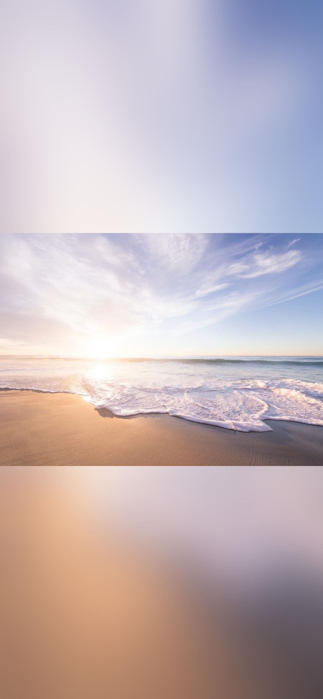

# Wallpaper Creator

## Synopsis

Allows the user to upload a photo, and creates a wallpaper for their device. The wallpaper consists of the photo centered over a blurred background. This is especially useful for photos with an aspect ratio that is more horizontal than vertical. So it turns this:

Into this:

## Contributors

**Dominic Brant**.

If you have any thoughts/suggestions/problems, feel free to open an [issue](https://github.com/dombrant/wallpaper-creator/issues).

## License

MIT© [Dominic Brant](https://dombrant.com)
